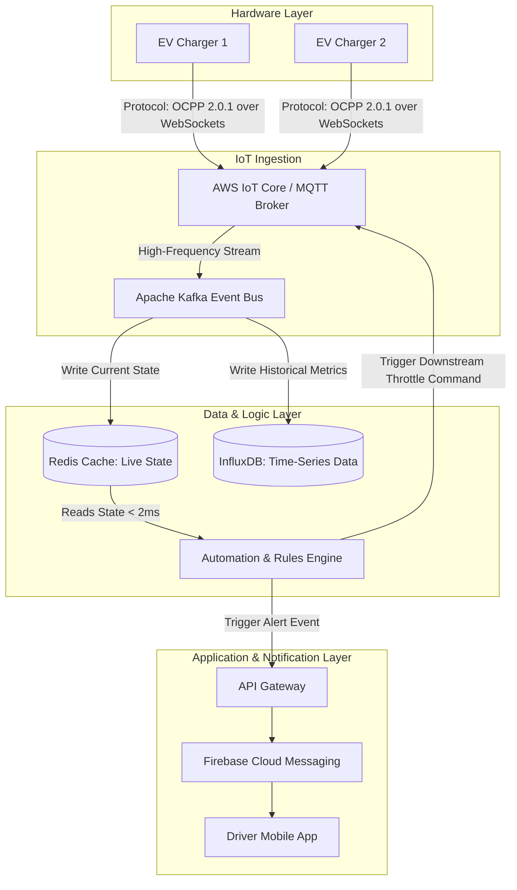

# GridPulse EV: IoT-Driven Smart Charging & Grid Optimization Platform
> **A Technical Product Management Case Study**  
> *Focus Areas: Product Strategy, Intelligent Automation, System Design*

---

## 📌 Executive Summary
With the rapid adoption of Electric Vehicles (EVs) in India, distribution grids face massive instability. During peak evening hours (6 PM – 10 PM), concurrent EV charging causes local transformer overloads and voltage drops. 

**GridPulse EV** is an IoT-powered SaaS platform designed for Grid Operators and Charge Point Operators (CPOs). It dynamically balances grid load using real-time IoT data streams, intelligent automated throttling, and Time-of-Use (ToU) customer incentives—ensuring grid stability without compromising the driver experience.

---

## 🎯 Part 1: Product Strategy

### The Problem Space
* **Grid Strain:** Simultaneous high-power charging (e.g., 22 kW fast chargers) peaks during grid-stressed hours, forcing utility providers to deploy expensive, carbon-heavy "peaker" plants.
* **The Business Dilemma:** Upgrading physical grid infrastructure (substations, transformers) takes years and billions in capital. A software-driven demand-response solution is required immediately.

### User Personas & Value Proposition
* **The Grid Operator (Utility Companies):** Needs to keep localized grid utilization below 85% capacity to prevent asset degradation and blackouts.
* **The EV Driver:** Wants their vehicle charged to target levels by their morning departure time at the lowest possible cost.

### Core Metrics (The Business Dashboard)
* **North Star Metric:** `Peak Load Reduction (%)` — The percentage drop in peak electricity demand achieved via automated throttling.
* **Guardrail Metric:** `Grid Uptime (%)` — Elimination of localized transformer trips or voltage failures.
* **Customer Retention Metric:** `Target Charge Achievement Rate (%)` — The percentage of sessions where vehicles reached the driver’s requested state-of-charge (SoC) by their departure time.

---

## 🤖 Part 2: Intelligent Automation Architecture

GridPulse EV replaces manual monitoring with two high-frequency automated feedback loops.

### Loop 1: Real-Time Grid Load Mitigation
* **Trigger:** Local substation telemetry signals that asset capacity has crossed **85% utilization**.
* **Condition:** Identify all active charging sessions within that specific transformer node designated as "Standard Tier".
* **Automated Action:** 
  1. The Rules Engine broadcasts a downstream command packet to physical EVSEs (Electric Vehicle Supply Equipment) lowering output from **22 kW to 7.4 kW** (a 66% instant power reduction).
  2. A webhook triggers a push notification payload to the driver's mobile application: 
     > *"Grid optimization active! Your charging speed has been throttled to protect local infrastructure. Tap to override for a ₹50 peak-hour premium fee."*

### Loop 2: Eco-Smart Charging Scheduler
* **Trigger:** User plugs in their vehicle at 7:00 PM and selects a 7:00 AM departure target via the app.
* **Condition:** Current grid prices are high; regional solar/wind generation forecast indicates an energy surplus between 2:00 AM and 5:00 AM.
* **Automated Action:** The system puts the physical hardware into an "Idle/Standby" state, calculation-blocks immediate draw, and shifts 80% of the required charging block to the optimal 3-hour off-peak window.

---

## 🏗️ Part 3: System Design & Data Architecture

To process state metrics from thousands of IoT endpoints concurrently with sub-second latency, GridPulse EV leverages an event-driven microservices architecture.

### Architecture Diagram

### Architectural Decisions (Tech PM Specifications)
* **OCPP 2.0.1 Protocol:** Built natively over JSON WebSockets to handle bidirectional telemetry and configuration profiles between the cloud and charging hardware globally.
* **Apache Kafka:** Utilized as an ingestion tier buffer to comfortably manage horizontal scaling when processing simultaneous payloads (Voltage, Current, State of Charge, Temperature) sent every 2 seconds.
* **Redis Caching:** The Automation Rules Engine evaluates states continuously. Fetching current node capacities from a relational database introduces catastrophic latency. Storing active metrics in an in-memory Redis cluster drops lookup latency to **< 2ms**, preventing automation lag.
* **InfluxDB:** Selected as the time-series archival ledger to manage millions of historical data data points efficiently, feeding downstream forecasting models.

---

## 🚀 Key Learning Takeaways
1. **Product Strategy:** Learned how to balance complex ecosystem trade-offs where one user's benefit (utility grid savings) potentially disrupts another user's convenience (slower charging speeds), resolving conflicts via economic and gamified features (discounts vs. surge pricing).
2. **Intelligent Automation:** Gained structural experience mapping business logic thresholds directly into deterministic, automated software rules and system dependencies.
3. **System Design:** Mastered the structural principles of decoupling high-scale IoT ingestion pipelines from business logic apps using event streams, real-time memory caches, and industry-standard communication protocols.
